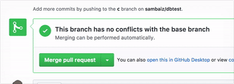

## mysql-migration-slack 

When [goose](https://github.com/pressly/goose) repository is merged to master, create a new version and post the migration button to slack.



- Not necessary to change the version even if it postpone to apply due to review and fix
- Easy to start migration and inform

## Goose Repository

Create goose repository with the following structure.

```
goose/
  .keep
.circleci/config.yml
create_test_table.sql
```

### sample

Write a migration sql (e.g. create_test_table.sql)

```
$ cat create_test_table.sql
-- +goose Up
-- SQL in this section is executed when the migration is applied.
CREATE TABLE testtable (
  id BIGINT UNSIGNED PRIMARY KEY AUTO_INCREMENT,
  n INT NOT NULL,
  c VARCHAR (20) NOT NULL UNIQUE
);

-- +goose Down
-- SQL in this section is executed when the migration is rolled back.
DROP TABLE testtable;
```

### config.yml

If there is a new sql, create a new version and post migration button to slack.

Use user key (readable/writable) for checkout key.

```
version: 2
jobs:
  build:
    docker:
      - image: circleci/golang:1.8
    branches:
      only:
        - master
    steps:
      - checkout
      - run:
          name: Create new version
          command: |
            if [ -e *.sql ]; then
              VERSION=$(ls -U1 goose | wc -l | xargs expr 1 + | xargs printf %05d)
              FILENAME=$(find . -maxdepth 1 -name "*.sql" | head | xargs basename)
              mv ${FILENAME} goose/${VERSION}_${FILENAME}
              git config --global user.email "circleci@example.com"
              git config --global user.name "CircleCI"
              git add .
              git commit -m "[CI] version ${VERSION}"
              git push origin master
              COMMIT=$(git rev-parse HEAD)
              curl -H "Authorization: Basic $(echo -n 'foobar:dolphins' | base64)" "https://*****.ngrok.io/auth/message?version=${VERSION}&filename=${FILENAME}&commit=${COMMIT}"
            fi
```
